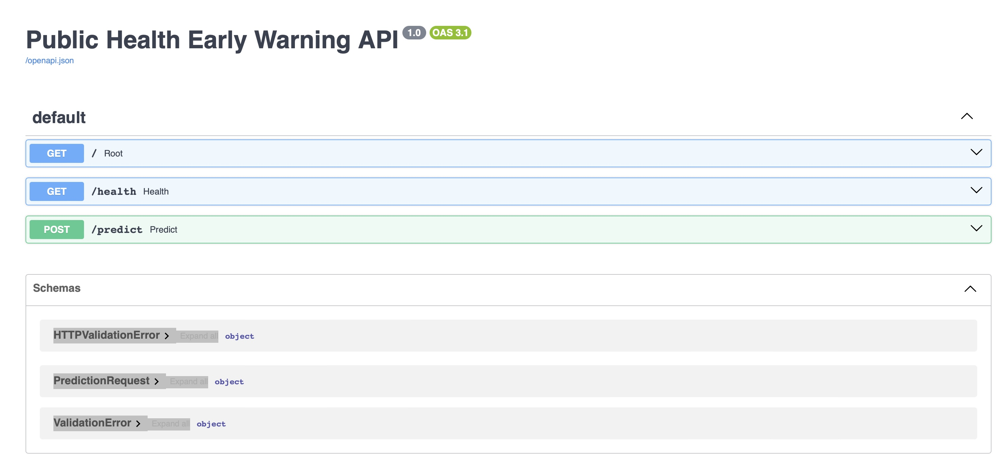

# Public Health Outbreak Severity Prediction (MLOps Project)

## API Demo

## Live API

The deployed API is available here:

https://outbreak-severity-api.onrender.com/docs

## Overview
This project builds an end-to-end machine learning system that analyzes disease outbreak reports and predicts whether an outbreak is high 
severity or low severity. 
The goal is to demonstrate how machine learning can support early warning systems for public health by automatically analyzing outbreak
reports and identifying events that may require urgent attention.The system processes outbreak text, extracts epidemiological indicators such 
as reported cases and deaths, and combines them with natural language features to generate a severity prediction. 
This repository also demonstrates the full machine learning lifecycle, including data processing, model training, explainability, and 
deployment as a production API.

## Motivation
Disease outbreak reports contain valuable information for public health monitoring, but manual analysis does not scale when reports are 
collected from multiple sources.
This project explores how machine learning can assist with: 
identifying severe outbreaks quickly 
prioritizing public health response 
supporting decision-makers with interpretable predictions 
The system is intended as a decision support tool, not a replacement for epidemiological expertise.

## Dataset
The dataset consists of World Health Organization Disease Outbreak News (DON) reports.
The reports were collected through web scraping and contain information about: 
outbreak description 
case counts 
death counts 
geographic regions 
public health response

Each report is labeled as high severity or low severity based on epidemiological indicators such as reported deaths, case counts, and 
risk language.

## Feature Engineering
The model combines textual information and structured epidemiological signals.

### Text Features
Natural language processing is applied using TF-IDF vectorization to capture important words and phrases related to disease outbreaks.
Examples include: 
outbreak 
deaths 
confirmed cases 
Ebola 
yellow fever 

### Structured Features
Additional features are extracted from the report text: 
number of reported deaths 
number of reported cases 
presence of high-risk emergency phrases 
Log transformations are applied to numeric variables to reduce skew.

## Model
The final model is a hybrid classification system combining: 
TF-IDF text features 
structured outbreak indicators 
A logistic regression classifier is trained on the combined feature space.

Performance
Final hybrid model results: 
Accuracy: ~95% 
ROC-AUC: ~0.99 
False negatives: very low after threshold tuning 
The model prioritizes recall for severe outbreaks, which is important in early warning systems.

Model Explainability
To ensure interpretability, the project includes SHAP analysis to understand feature contributions. 
The most influential features include: 
reported deaths 
emergency risk phrases 
reported case counts 
This allows users to see why the model flagged an outbreak as severe.

## Deployment
The trained model is deployed as a FastAPI web service. 
The API: 
receives outbreak text 
extracts structured features 
applies TF-IDF vectorization 
generates a severity prediction 
returns the result as JSON 
Example API response: 
{ 
  "severity_prediction": 1, 
  "probability_severe": 0.96 
} 
The service is deployed on Render. 
API Endpoints 
Health Check 
GET /health 
Confirms that the service is running. 

Prediction Endpoint 
POST /predict 
Example request: 
{ 
  "report": "Ebola outbreak reported with 350 deaths and rapid spread across multiple regions." 
} 

## Project Structure
outbreak-severity-mlops 
│ 
├── app.py 
├── feature_pipeline.py 
├── requirements.txt 
├── severity_model.pkl 
├── tfidf_vectorizer.pkl 
├── notebooks 
│   └── modeling_and_analysis.ipynb 
└── README.md

## Technologies Used
Python 
Scikit-learn 
FastAPI 
Pandas 
NumPy 
SHAP 
Uvicorn 
Render (deployment) 

Example Use Cases 
Potential applications include: 
automated monitoring of outbreak reports 
prioritizing global health alerts 
assisting epidemiological surveillance systems 

Ethical Considerations 
This system should be used only as a support tool for analysts and public health professionals. 
Machine learning predictions should always be interpreted alongside expert judgment.

Future Improvements 
Possible extensions include: 
incorporating additional data sources 
adding geographic outbreak modeling 
training transformer-based NLP models 
building a real-time dashboard for outbreak monitoring 

## Run Locally

Clone the repository

git clone https://github.com/princeappiah181/outbreak-severity-mlops.git

cd outbreak-severity-mlops

Install dependencies

pip install -r requirements.txt

Start the API

uvicorn app:app --reload

Open the API docs

http://127.0.0.1:8000/docs

## Author
Prince Appiah, Ph.D  
Data Science

This project was developed as part of a practical exploration of machine learning in production and public health analytics.
