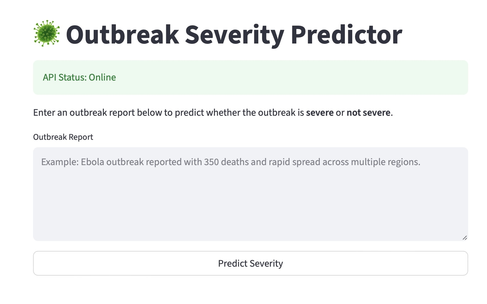
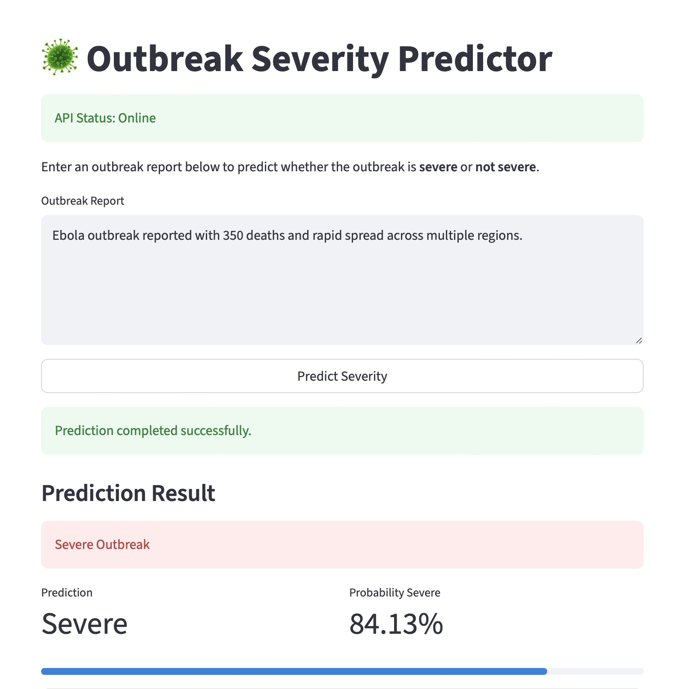

# Public Health Outbreak Severity Prediction - End-to-End ML System

## Live Demo 
Streamlit App

The deployed UI is available here:
https://outbreak-severity-mlops-8g9tnu3artsgreihxidvub.streamlit.app/

## API Documentation

The deployed API is available here:

https://outbreak-severity-api.onrender.com/docs

## Overview
This project builds an end-to-end machine learning system that analyzes disease outbreak reports and predicts whether an outbreak is high severity or low severity. 
The goal is to demonstrate how machine learning can support early warning systems for public health by automatically analyzing outbreak reports and identifying events that may require urgent attention. 
The system processes outbreak text, extracts epidemiological indicators such as reported cases and deaths, and combines them with natural language features to generate a severity prediction. 
This repository demonstrates the complete machine learning lifecycle, including: 
data processing 
feature engineering 
model training 
explainability 
API deployment 
browser-based inference interface 

## System Architecture
User Interface (Streamlit) 
        ↓ 
FastAPI REST API 
        ↓ 
Feature Engineering 
        ↓ 
TF-IDF Vectorization 
        ↓ 
Logistic Regression Model 
        ↓ 
Severity Prediction 

The architecture separates the user interface, API layer, and machine learning model, reflecting a common production ML system design.

## Motivation
Disease outbreak reports contain valuable information for public health monitoring, but manual analysis becomes difficult as the volume of reports increases. 
This project explores how machine learning can assist with: 
identifying severe outbreaks quickly 
prioritizing public health responses 
supporting decision-makers with interpretable predictions 
The system is intended as a decision support tool, not a replacement for epidemiological expertise. 

## Dataset
The dataset consists of World Health Organization Disease Outbreak News (DON) reports. 
Reports were collected through web scraping and contain information about: 
outbreak descriptions 
reported cases 
reported deaths 
geographic regions 
public health responses 
Each report is labeled as high severity or low severity based on epidemiological indicators such as reported deaths, case counts, and risk language. 

## Feature Engineering
The model combines textual features with structured epidemiological signals. 

Text Features  

Natural language processing is applied using TF-IDF vectorization to capture important outbreak-related words and phrases. 
Examples include: 
outbreak 
deaths 
confirmed cases 
Ebola 
yellow fever 

Structured Features 

Additional signals are extracted from the report text: 
number of reported deaths 
number of reported cases 
presence of high-risk emergency phrases 
Log transformations are applied to numeric variables to reduce skew. 

Model 
The final model is a hybrid classification system combining: 
TF-IDF text features 
structured outbreak indicators 
logistic regression classifier 

Performance 

Final hybrid model results: 
Accuracy: ~95% 
ROC-AUC: ~0.99 
False negatives: minimized after threshold tuning 
The model prioritizes recall for severe outbreaks, which is critical for early warning systems. 

Model Explainability 
To improve interpretability, the project includes SHAP analysis to understand feature contributions. 
The most influential predictors include: 
reported deaths 
emergency risk phrases 
reported case counts 
This allows analysts to understand why the model flagged an outbreak as severe. 

## Deployment
The trained model is deployed as a FastAPI web service and exposed through a REST API. 
The API: 
receives outbreak text 
extracts structured features 
applies TF-IDF vectorization 
generates a severity prediction 
returns the result as JSON 

Example response: 
{ 
  "severity_prediction": 1, 
  "probability_severe": 0.96 
} 

The backend API is deployed on Render, while the user interface is deployed on Streamlit Community Cloud. 

## API Endpoints

Health Check 
GET /health 
Confirms that the API service is running. 

Prediction Endpoint 
POST /predict 
Example request: 
{ 
  "report": "Ebola outbreak reported with 350 deaths and rapid spread across multiple regions." 
} 

## Project Structure
outbreak-severity-mlops
│
├── app.py
├── streamlit_app.py
├── feature_pipeline.py
├── requirements.txt
├── severity_model.pkl
├── tfidf_vectorizer.pkl
│
├── images/
│   └── api_demo.jpg
│   └── ui_demo.jpg
│
├── notebooks/
│   └── scoping_data_modeling_deployment_updated.ipynb
│
└── README.md

## Technologies Used
Python 
Scikit-learn 
FastAPI 
Streamlit 
Pandas 
NumPy 
SHAP 
Uvicorn 
Render (API deployment) 
Streamlit Community Cloud (UI deployment) 

## Example Use Cases
Potential applications include: 
automated monitoring of outbreak reports 
prioritizing global health alerts 
assisting epidemiological surveillance systems 
supporting public health decision-making 

## Ethical Considerations
This system should be used only as a support tool for analysts and public health professionals. 
Machine learning predictions should always be interpreted alongside expert judgment.

## Future Improvements
Possible extensions include: 
incorporating additional outbreak data sources 
adding geographic outbreak modeling 
training transformer-based NLP models 
building a real-time outbreak monitoring dashboard 

## Run Locally
Clone the repository: 
git clone https://github.com/princeappiah181/outbreak-severity-mlops.git 

Navigate to the project: 
cd outbreak-severity-mlops 

Install dependencies: 
pip install -r requirements.txt 

Start the API: 
uvicorn app:app --reload 

Open the API documentation: 
http://127.0.0.1:8000/docs 

Run the Streamlit interface: 
streamlit run streamlit_app.py 

## Author
Prince Appiah, Ph.D 
Data Science 

This project was developed as a practical exploration of machine learning in production and public health analytics.

